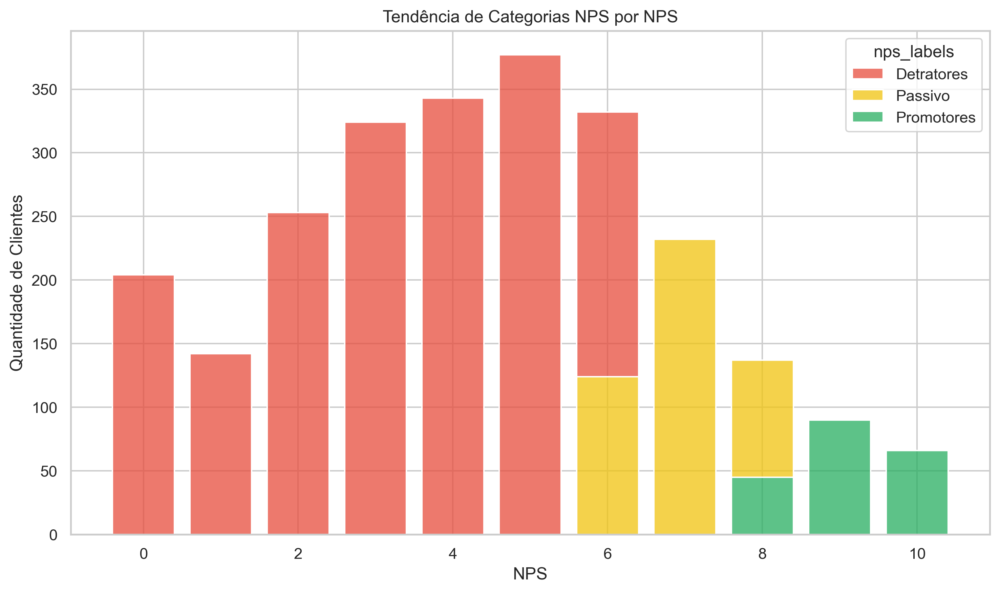
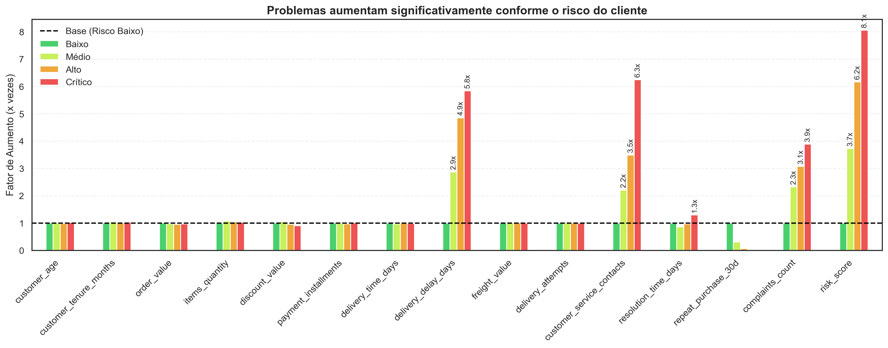
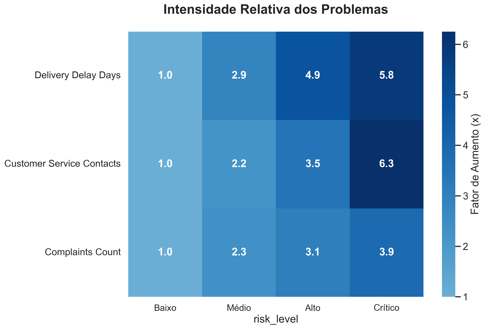
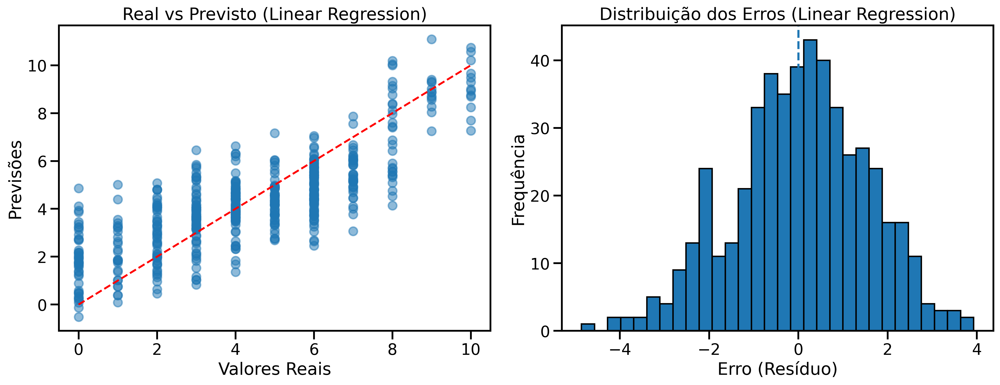
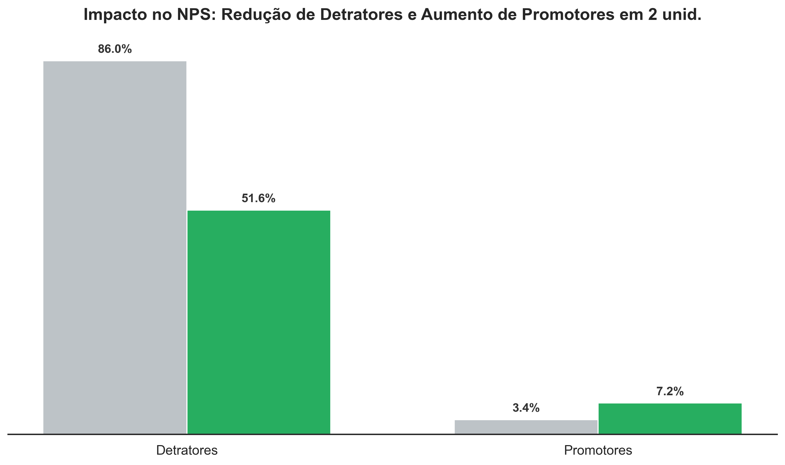

# Tech_challenge_01


Esse foi um trabalho de estudos da Pós graduação de DataScience com I.A da Faculdade FIAP do primeiro bimestre. <br>
Com o crescimento acelerado do e-commerce nacional, temos o cenário de 
uma empresa que passou a lidar com um volume cada vez maior de pedidos, entregas 
e interações com clientes. <br>

Esse crescimento trouxe ganhos importantes de escala, 
mas também revelou desafios relevantes na experiência do cliente, especialmente 
refletidos na alta variabilidade do Net Promoter Score (NPS) entre diferentes perfis de 
consumidores. <br>

A área de Experiência do Cliente percebeu que, mesmo com 
indicadores operacionais aparentemente semelhantes, alguns clientes se tornam 
promotores da marca, enquanto outros se tornam detratores.  
Essa diferença levanta uma questão central para o negócio: quais fatores 
operacionais realmente influenciam a satisfação do cliente e como a empresa 
pode agir de forma proativa para melhorar a experiência antes mesmo da 
aplicação da pesquisa de NPS?

<br>
<br>
<br>

<a target="_blank" href="https://cookiecutter-data-science.drivendata.org/">
    
</a>

NPA Data Project


```text
==================== ESTRUTURA DO PROJETO ====================

📁 tech_challenge_01/
├── 📄 Makefile                    - Comandos convenientes (make data, make lint, etc)
├── 📄 pyproject.toml              - Configuração do projeto e dependências
├── 📄 README.md                   - Documentação do projeto
├── 📄 requirements.txt            - Dependências Python
├── 📁 data/
│   ├── external/                  - Dados de terceiros
│   ├── interim/                   - Dados transformados
│   ├── processed/                 - Dados finais para modelagem
│   └── raw/
│       └── desafio_nps_fase_1.csv - Dataset principal do desafio
├── 📁 docs/                       - Documentação (mkdocs)
│   ├── images/                     - Gráficos e figuras geradas
├── 📁 models/                     - Modelos treinados e serializados
├── 📁 notebooks/
│   └── teach_challenge.ipynb      - Notebook principal de análise
└── 📁 tech_challenge_01/          - Código fonte do projeto
    ├── __init__.py
    ├── config.py                  - Variáveis e configuração
    ├── dataset.py                 - Scripts de download/geração de dados
    └── features.py                - Código para criar features
```
--------

# 📊 Predição de NPS em E-commerce

## 📝 Sobre o Projeto
Este projeto tem como objetivo prever o **Net Promoter Score (NPS)** atribuído por clientes de um e-commerce após a jornada de compra. Através de um modelo de regressão em Python, analisamos variáveis como valor do pedido, valor do frete e tempo de atraso na entrega para entender e prever a satisfação do cliente, permitindo ações proativas de melhoria contínua.

## 🛠️ Tecnologias e Bibliotecas Utilizadas
* **Linguagem:** Python
* **Manipulação e Análise de Dados:** Pandas, NumPy, SciPy
* **Visualização:** Matplotlib, Seaborn
* **Machine Learning:** Scikit-Learn, XGBoost

## ⚙️ Estrutura do Fluxo de Trabalho
1. **Análise Exploratória de Dados (EDA):** Verificação de distribuições, testes de normalidade e entendimento das variáveis de negócio (`order_value`, `delivery_delay_days`, etc.).
2. **Pré-processamento:** Limpeza de dados, codificação de variáveis categóricas (One-Hot Encoding) e separação em treino e teste.
3. **Modelagem Baseline:** Estabelecimento de um modelo ingênuo (previsão da média) para servir de base comparativa.
4. **Treinamento de Modelos:** Regressão Linear, Random Forest, Gradient Boosting, XGBoost.
5. **Otimização:** Busca pelos melhores hiperparâmetros utilizando `GridSearchCV`.
6. **Avaliação e Simulações:** Comparação de performance utilizando métricas estatísticas e simulações de impacto de melhorias de negócio no NPS final.


## 🎯 Analises EDA
nós temos uma base com sua maioria de detratores.




### 📊 Cálculo do Risk Score

O *risk score* foi desenvolvido para identificar clientes com maior probabilidade de serem detratores no NPS, com base em variáveis operacionais críticas.

A pontuação é calculada de forma aditiva, considerando a presença de determinados problemas e seus respectivos pesos:

- **Reclamações (complaints_count ≥ 3)**  
  Peso: **2**  
  Justificativa: forte correlação negativa com o NPS (-0.44)

- **Atraso na entrega (delivery_delay_days ≥ 2)**  
  Peso: **2**  
  Justificativa: forte correlação negativa com o NPS (-0.41)

- **Contatos com o SAC (customer_service_contacts ≥ 2)**  
  Peso: **1**  
  Justificativa: correlação moderada (-0.24)

- **Tempo de resolução (resolution_time_days ≥ 3)**  
  Peso: **1**  
  Justificativa: correlação mais baixa (-0.15)

#### 🧮 Fórmula

O cálculo do score é dado por:

```
risk_score = Σ(weight × issue_indicator)

onde:
- weight = peso da variável (2 ou 1)
- issue_indicator = 1 se o problema ocorreu, 0 caso contrário
```

## 🏷️ Categorização de Risco

Com base no *risk score*, os clientes são classificados em 4 categorias:

| Faixa de Pontuação | Categoria | Condições |
|--------------------|-------------|-----------|
| **-1 a 1** | **Baixo** | No máximo 1 problema leve |
| **2 a 3** | **Médio** | Problema grave ou combinação de problemas leves |
| **4 a 5** | **Alto** | Combinação de problemas graves |
| **6** | **Crítico** | Pontuação máxima (combinação de problemas graves) |

após criarmos os perfis de risco baseados em evidencias que tivemos ao analisar os pontos de rupturas de cada variavel
identificamos as três maiores razões para os clientes se tornarem detratores e qual a proporção desses problemas os detratores costumam enfrentar em relação aos promotores:



Clientes de risco crítico em média, apresentam cerca de 6 vezes mais dias de atraso do que clientes de baixo risco. <br>
Clientes de risco crítico em média, apresentam cerca de 6 vezes mais contatos com o SAC do que clientes de baixo risco. <br>
Clientes de risco crítico em média, reclamam 4 vezes do que clientes de baixo risco.<br>

o mapa de calor abaixo indica a proporção das três principais variaveis.


## 🏆 Resultados dos Modelos

Testamos diversos algoritmos de aprendizado de máquina para encontrar aquele com a menor taxa de erro (MAE/RMSE) e melhor coeficiente de determinação (R²):

| Modelo                   | MAE   | RMSE  | R²    |
|--------------------------|-------|-------|-------|
| **Baseline (Média)**     | 2.069 | 2.514 | -     |
| **Regressão Linear**     | 1.193 | 1.497 | 0.645 |
| **XGBoost Regressor**    | 1.206 | 1.527 | 0.631 |
| **Random Forest (Tuned)**| 1.230 | 1.528 | 0.631 |
| **Gradient Boosting**    | 1.207 | 1.503 | 0.643 |

O **Gradient Boosting Regressor** apresentou a melhor performance geral por uma pequena margem, reduzindo o Erro Absoluto Médio (MAE) de 2.07 (baseline) para ~1.21. 

No entanto, o ganho em relação aos demais modelos é incremental, com desempenho muito próximo ao da Regressão Linear e do XGBoost, indicando que o problema possui forte componente linear e que modelos mais complexos trazem ganhos limitados.





## 📈 Simulações e Impacto no NPS

### Abordagem de Simulação de Negócios
Para garantir que nossas simulações de cenários fossem acionáveis e confiáveis, construímos funções de simulação focadas no comportamento preditivo. A abordagem envolve:

1. **Simulação de Impacto Marginal:** Reduzimos as variáveis de atrito (como dias de atraso ou volume de contatos no SAC) unidade por unidade, recalculando a nota média prevista do cliente. Isso nos permitiu comparar visualmente quais alavancas possuem a resposta mais rápida e elástica na satisfação.
2. **Simulação de Cenários Combinados:** Em vez de atuar em uma única frente, aplicamos o modelo preditivo a toda a base simulando melhorias conjuntas (ex: redução simultânea de atrasos e contatos no SAC). Ao recalcular as notas, medimos a migração real de clientes da categoria de Detratores para Neutros e Promotores, obtendo o ganho final projetado em pontos de NPS.

O resultado é uma análise altamente acionável. Em vez de termos apenas uma estimativa técnica de erro, transformamos o modelo em uma ferramenta de suporte à decisão para que as equipes de Logística e CX priorizem seus esforços onde o ganho de NPS é matematicamente maior.


Além da predição, utilizamos os modelos para entender **como a melhoria na operação afeta o NPS final**. Simulamos a redução de atritos logísticos e de atendimento:

### Impacto da Logística e Atendimento
Ao analisar o impacto de "Dias de Atraso" e "Número de Contatos com o SAC", identificamos que reduzir os atrasos de entrega é o fator que mais rapidamente gera melhora nas notas previstas. 
Fizemos a analise das variaveis isoladas e depois analisamos o impacto combinado. 


### Cenário Combinado: O Antes vs. Depois
Construímos cenários otimistas de atuação em logística e operação. Em uma das nossas simulações, ao combinarmos redução no atraso de entrega e contatos do SAC, conseguimos obter ganhos de até **+31 pontos** no NPS final, impulsionado por uma **redução drástica no volume de Detratores** (caindo de 86% para 52%) melhorando apenas em 2 unidades de risco.



*(Painel de análise comparando a proporção de Detratores e Promotores antes e depois das melhorias implementadas no modelo. diminuindo o atraso em 2 dias e os contatos do SAC em 2 contatos )*

## 🚀 Como Executar o Projeto

1. Clone este repositório:
   ```bash
   git clone https://github.com/LucasRuizMartins/fiap_tech_challenge_01
   ```

2. Instale as bibliotecas necessárias:
   ```bash
   pip install -r requirements.txt
   ```

3. Abra e execute o notebook Jupyter:
   ```bash
   jupyter notebook notebooks/teach_challenge.ipynb
   ```

------

## 📉 Próximos Passos e Melhorias Planejadas (Roadmap)
Como parte da evolução contínua deste modelo de dados, os seguintes refinamentos estão mapeados:

- [ ] **Tratamento Avançado de Outliers:** Aplicação de Z-Score em variáveis contínuas (como valor de frete e atraso) para estabilizar modelos lineares.
- [ ] **Feature Scaling:** Implementação de StandardScaler ou MinMaxScaler para equalizar as grandezas das variáveis independentes.
- [ ] **Estratificação de Dados:** Utilização de bins e do parâmetro stratify no train-test split para garantir a representatividade das notas na validação.
- [ ] **Limitação Dimensional (Clipping):** Trava estatística nas predições de regressão para mantê-las estritamente no intervalo lógico de 0 a 10.
- [ ] **Abordagem de Classificação:** Teste de uma modelagem paralela focada em prever a categoria do cliente (Detrator, Passivo, Promotor) para gerar insights diretos para as equipes de CX.
- [ ] **Cálculo de Intervalo:** Para cada nota, calcular os intervalos de confiança de 95% e 99% para a probabilidade. Isso permite quantificar a incerteza associada a cada cenário.